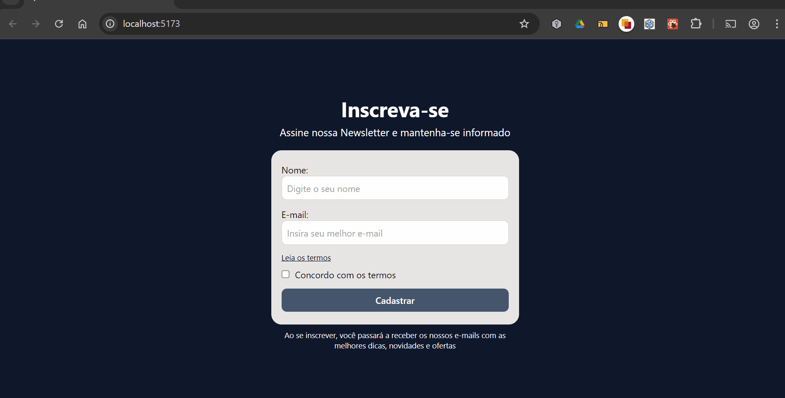

# 🚀 Formulário com Validação em React e TypeScript



> Aplicação de formulário de newsletter com validação de campos em tempo real, construída com React, TypeScript e Tailwind CSS.

### 🔗 [Acesse a Demo Ao Vivo](https://formulario-newsletter-phi.vercel.app/)

---

### ✨ Funcionalidades Principais

- **Validação em Tempo Real:** Feedback instantâneo para o usuário enquanto ele digita, melhorando a usabilidade.
- **Mensagens de Erro Claras:** Exibe mensagens específicas para cada campo inválido (ex: "E-mail inválido", "Campo obrigatório").
- **Tipagem com TypeScript:** Garante a segurança dos dados e melhora a experiência de desenvolvimento.
- **Botão de Envio Inteligente:** O botão de submissão permanece desabilitado até que todos os campos sejam preenchidos corretamente.
- **Estado de Sucesso:** Mostra um modal de sucesso elegante após o envio válido do formulário.
- **Design Responsivo:** Interface limpa e funcional em todos os tamanhos de tela.

---

### 🛠️ Stack de Tecnologias

- **React** e **Vite** para a interface e o ambiente de desenvolvimento.
- **TypeScript** para tipagem estática e segurança do código.
- **Tailwind CSS** para estilização rápida e utilitária.
- **SweetAlert2** para exibir modais de feedback ao usuário.
- **ESLint** para manter a qualidade e o padrão do código.

---

### 🔧 Como Rodar o Projeto

```bash
# 1. Clone o repositório
git clone https://github.com/alanborgesdev/formulario-newsletter.git

# 2. Navegue até o diretório
cd formulario-newsletter

# 3. Instale as dependências com NPM ou Yarn
npm install
# ou
yarn install

# 4. Inicie a aplicação em modo de desenvolvimento
npm run dev
# ou
yarn dev

# 5. Abra http://localhost:5173 (ou a porta indicada no terminal) no seu navegador.
```
---

### 👤 Autor  

Este projeto foi desenvolvido por **[Alan Borges](https://github.com/alanborgesdev)**.

---

### 📝 Licença

O código-fonte deste projeto está licenciado sob a [Licença MIT](LICENSE).
