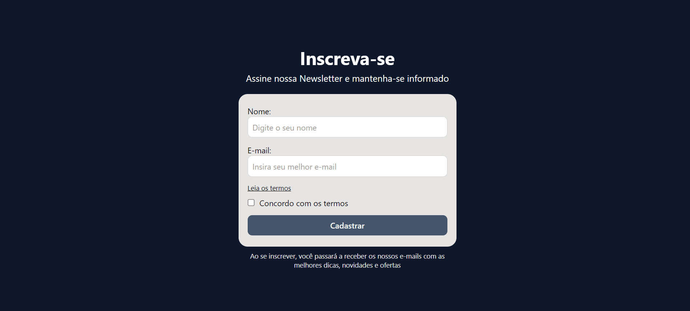

# Formulário de Newsletter


## Descrição

Este é um projeto de Formulário de Newsletter com validação de campos, desenvolvido utilizando React, TypeScript e Tailwind CSS. Ele valida nome, e-mail e aceitação dos termos antes de submeter.

## 📌 Tecnologias Utilizadas

- TypeScript
- Tailwind CSS
- Vite

## 📂 Estrutura do Projeto

```formulario-validacao/
│── public/
│── src/
│   ├── components/
│   │   ├── Form.tsx
│   ├── types/
│   │   ├── user.ts
│   ├── utils/
│   │   ├── validate.ts
│   ├── App.tsx
│   ├── main.tsx
│── index.html
│── tailwind.config.ts
│── tsconfig.json
│── vite.config.ts
│── package.json
│── README.md

```

## 🛠 Como Rodar o Projeto

1. Clone o repositório:
   ```sh
   git clone https://github.com/alanborgesdev/formulario-newsletter
   ```
2. Acesse a pasta do projeto:
   ```sh
   cd nome-do-repositorio
   ```
3. Abra o arquivo `index.html` em um navegador.

## 📸 Screenshots



## 📌 Autor  

Projeto desenvolvido por **[Alan Borges](https://github.com/alanborgesdev)**.

## 📝 Licença

O código-fonte deste projeto está sob a licença MIT.